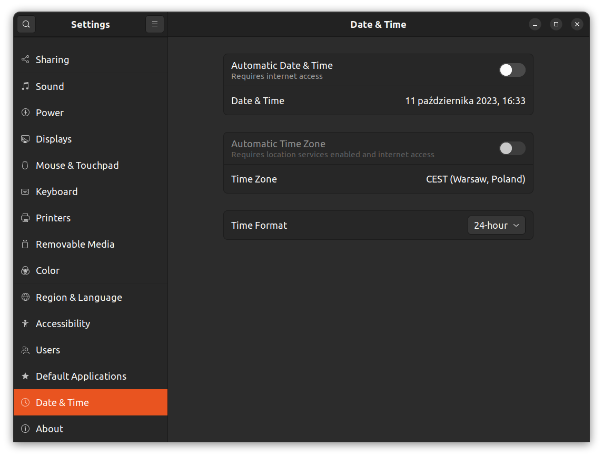

## About
This repository contains an example setup to reproduce the issue with TFs visualization in Foxglove.
I noticed this problem when visualizing data from a robot, when not connected to the Internet (and without time synchronization e.g. chrony).
All data, such as LaserScan from lidar was displayed from the most recent message, but TFs were synchronized - visualization in Foxglove waited until the time on the receiver device matched the sender's time.
I think that it will be a useful option for the Foxglove to not require synchronized time, and just display the latest states (for example in cases, when there is no Internet connection).
Some probably useful clue is also that it doesn't happen when using sim time - initially, I tried running a simulation with this setup, but it worked fine.
That's why the setup below uses software used on a physical robot but with some mock data (results are exactly the same, as observed on the real robot).

Below you can find steps to reproduce.

## Steps to reproduce

On the first device (computer with Ubuntu) turn off time synchronization:

Then, in the terminal, set the time to be a bit ahead:
```
sudo date -s "+10 seconds"
```

Now run provided compose:
```
docker compose up
```

In another terminal exec bash in the container:
```
docker exec -it rosbot_xl bash
```
And start publishing mock data:
```
ros2 topic pub /_motors_response sensor_msgs/msg/JointState "header:
  stamp:
    sec: 0
    nanosec: 0
  frame_id: ''
name: [fl_wheel_joint, fr_wheel_joint, rl_wheel_joint, rr_wheel_joint]
position: [0, 0, 0, 0]
velocity: [0, 0, 0, 0]
effort: []"
```

Connect to the Foxglove on another device (e.g. phone or other computer) - it is important to have differences in clock times between devices - you can adjust time further with the provided command.

Now Ctrl+C `ros2 topic pub` that you ran earlier and change it so that the robot will have some velocity:
```
ros2 topic pub /_motors_response sensor_msgs/msg/JointState "header:
  stamp:
    sec: 0
    nanosec: 0
  frame_id: ''
name: [fl_wheel_joint, fr_wheel_joint, rl_wheel_joint, rr_wheel_joint]
position: [0, 0, 0, 0]
velocity: [10, 10, 10, 10]
effort: []"
```
Observe TFs on the Foxglove - the robot will start moving only after the difference in clocks passes (in the provided example it should be 10 seconds). You can Ctrl+C command and once again publish 0 velocities - TFs will also react after 10 seconds.